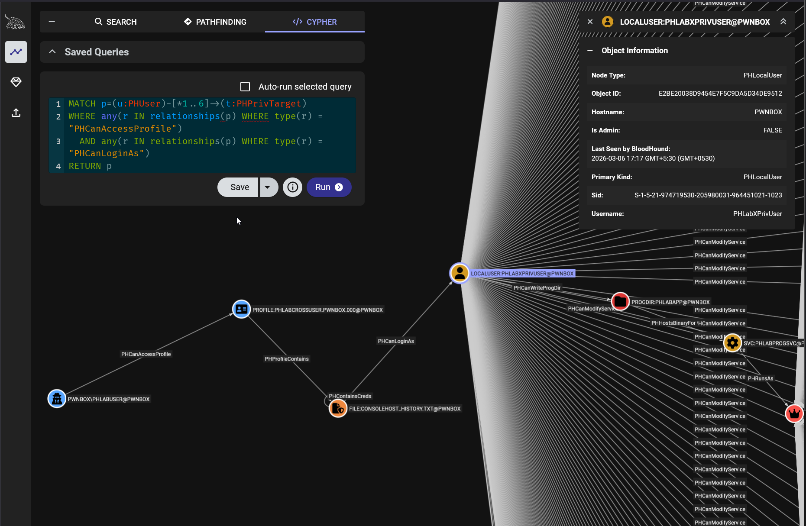
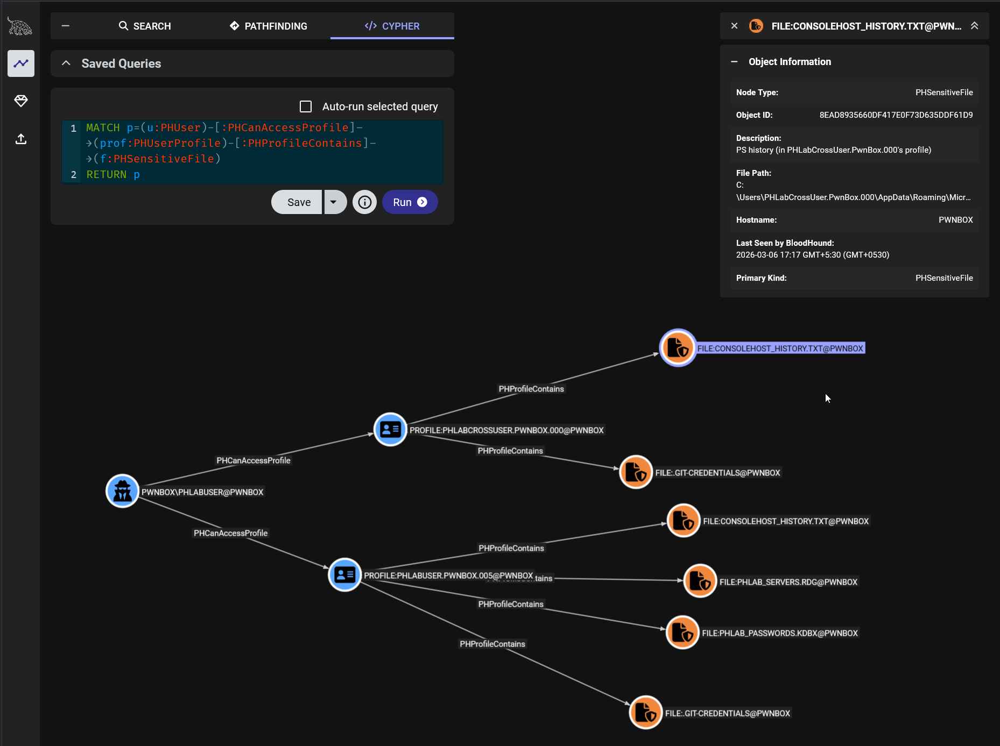
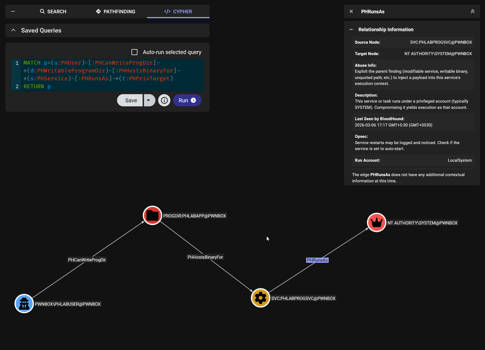

# PrivHound

**Local Privilege Escalation, as a Graph.**

A BloodHound OpenGraph collector that models Windows local privilege escalation as interconnected attack paths not a wall of text.

---

## The Problem

For a long time, BloodHound has proven that attackers think in graphs, transforming Active Directory misconfigurations from static checklists into explorable attack paths. Yet when it comes to local privilege escalation, the industry is still stuck in 2015: run a tool, read a wall of text, manually connect the dots or have LLM do it for you :P

WinPEAS, PowerUp, and Seatbelt are excellent at finding individual misconfigurations, but they cannot answer questions like:

- *"Does this writable Program Files directory actually lead to SYSTEM because a service runs a binary from it?"*
- *"Does this PowerShell history file contain credentials that are valid for a local admin?"*
- *"Can I read another user's profile, find their stored credentials, log in as them, and exploit a service they have write access to?"*

These tools report findings in isolation. In reality, privilege escalation is a **multi-step chain** where one finding feeds into another. A writable directory means nothing if no service runs from it. A credential in a history file means nothing if it doesn't belong to a privileged user. The real question is never "what misconfigurations exist?" — it's **"what can I actually reach from here?"**

If Active Directory attacks can be thought of as a graph, why not local privilege escalation?

## The Solution

PrivHound changes this by modeling local privilege escalation as a graph. Built on BloodHound's OpenGraph framework, it enumerates **29 categories** of Windows privilege escalation vectors, from weak service permissions to COM hijacking to WebClient relay and outputs them as interconnected nodes and edges.

The result: multi-hop escalation chains become **visible**, **queryable with Cypher**, and **overlayable on top of existing Active Directory attack paths**.

> **Example:** Your current user can read the profile of another user on the machine. That profile contains cleartext credentials stored on their desktop for a third user. That third user has write permission to a service binary running as Administrator. No existing tool connects these dots. PrivHound does automatically.

```
CurrentUser ─PHCanAccessProfile─→ OtherUser's Profile
  ─PHProfileContains─→ .git-credentials ─PHContainsCreds─→ ...
    ─PHCanLoginAs─→ UserX ─PHCanWriteBinary─→ VulnService ─PHRunsAs─→ SYSTEM
```



---

## What It Checks

| # | Check | Technique | MITRE |
|---|-------|-----------|-------|
| 1 | **Weak Service Permissions** | Modifiable services running as SYSTEM | T1574.011 |
| 2 | **Writable Service Binaries** | Replace service .exe with payload | T1574.010 |
| 3 | **Unquoted Service Paths** | Path hijacking via writable intermediate dirs | T1574.009 |
| 4 | **DLL Hijacking (PATH)** | Writable directories in system PATH | T1574.001 |
| 5 | **AlwaysInstallElevated** | Install malicious MSI as SYSTEM | T1548.002 |
| 6 | **Token Privileges** | SeImpersonate, SeDebug, SeBackup, etc. | T1134.001 |
| 7 | **Scheduled Tasks** | Writable binaries for SYSTEM tasks | T1053.005 |
| 8 | **Autorun Executables** | Writable binaries in Run/RunOnce keys | T1547.001 |
| 9 | **Registry Service Keys** | Writable service ImagePath in HKLM | T1574.011 |
| 10 | **Stored Credentials** | Credential Manager, AutoLogon passwords | T1552.001 |
| 11 | **GPP Cached Passwords** | Group Policy Preferences cpassword | T1552.006 |
| 12 | **Unattended Install Files** | Credentials in unattend/sysprep XML | T1552.001 |
| 13 | **PowerShell History** | PSReadLine history and transcripts | T1552.001 |
| 14 | **Sensitive Files** | SAM backups, .kdbx, .rdg, git-credentials | T1552.001 |
| 15 | **UAC Bypass Opportunities** | UAC misconfig or admin-not-elevated | T1548.002 |
| 16 | **Writable Program Directories** | Writable dirs in Program Files | T1574.010 |
| 17 | **Cross-User Profiles** | Readable profiles with sensitive files | T1552.001 |
| 18 | **Credential Login Paths** | Validate extracted creds against local users | T1078.003 |
| 19 | **Cross-User Privilege Escalation** | Analyze what discovered users can access | T1078.003 |
| 20 | **JIT Admin Tools** | MakeMeAdmin, CyberArk EPM, Admin By Request | T1548 |
| 21 | **Print Spooler / PrintNightmare** | Vulnerable Point and Print configuration | T1068 |
| 22 | **WSUS HTTP (non-SSL)** | WSUS MITM for SYSTEM code execution | T1557 |
| 23 | **SCCM/MECM NAA Credentials** | Network Access Account DPAPI extraction | T1552.001 |
| 24 | **COM Object Hijacking** | HKCU CLSID hijack for SYSTEM-context DLL load | T1546.015 |
| 25 | **Named Pipe Permissions** | Permissive SYSTEM pipe ACLs → impersonation | T1134.001 |
| 26 | **Cached Credentials** | DCC2, WiFi, WinSCP, FileZilla, PuTTY creds | T1552.001 |
| 27 | **WMI Event Subscriptions** | Writable WMI consumer binaries/scripts | T1546.003 |
| 28 | **WebClient Relay** | NTLM relay via WebClient to DC LDAP → SYSTEM | T1187 |
| 29 | **Service Recovery Commands** | Writable failure recovery command binaries | T1574.010 |
| 30 | **Shadow Copy Sensitive Files** | SAM/SYSTEM hives accessible in VSS snapshots | T1003.002 |

---

## Multi-Hop Attack Paths

This is what separates PrivHound from traditional privesc tools. Instead of listing findings in isolation, PrivHound connects them into exploitable chains:

| Chain | Path |
|-------|------|
| **Credential pipeline** | `User → PSHistory → PHContainsCreds → PHCanLoginAs → LocalUser → Admin` |
| **Writable dir → service** | `User → WritableProgramDir → PHHostsBinaryFor → Service → SYSTEM` |
| **Cross-user profile** | `User → Profile → SensitiveFile → PHCanLoginAs → LocalUser → Admin` |
| **Cross-user escalation** | `User → (creds) → PHCanLoginAs → UserX → PHCanWriteBinary → Service → SYSTEM` |
| **SeBackup sub-chain** | `User → SeBackup → PHCanReadProtected → SAM → PHCanExtractHashes → Admin` |
| **Stored creds → runas** | `User → StoredCred → PHCanLoginViaRunas → LocalUser → Admin` |
| **SCCM NAA → creds** | `User → SCCMCred → PHContainsCreds → PHCanLoginAs → Admin` |
| **WebClient relay** | `User → WebClientRelay → PHEscalatesTo → SYSTEM` |
| **COM hijack** | `User → COMHijack → PHExecutesAs → SYSTEM` |
| **WMI subscription** | `User → WMISubscription → PHRunsAs → SYSTEM` |
| **Named pipe** | `User → NamedPipe → PHRunsAs → SYSTEM` |
| **Service recovery** | `User → PHCanWriteRecoveryBin → Service → SYSTEM` |
| **Shadow copy hashes** | `User → ShadowCopy → SAM → PHCanExtractHashes → Admin` |
| **JIT admin** | `User → MakeMeAdmin → PHGrantsTempAdmin → Admin` |

---

## Cross-User Privilege Escalation

When PrivHound discovers valid credentials for other local users (via GPP passwords, AutoLogon, unattend files, PowerShell history, cross-user profiles, etc.), it doesn't stop at creating a `PHCanLoginAs` edge. It analyzes what those discovered users can actually do.

**How it works (no SeImpersonatePrivilege required):**

1. `LogonUser` obtains a token handle for each discovered user
2. `GetTokenInformation` extracts group memberships (SIDs) and token privileges
3. ACL checks run using the discovered user's groups — not the current user's
4. Edges are created from the discovered user's node to any vulnerable resources they can access
5. The token is closed — no impersonation occurs, no elevated privileges needed

**What it checks for each discovered user:**

| Sub-check | Edge created |
|-----------|-------------|
| Service binary write | `PHCanWriteBinary` |
| Service SDDL modify | `PHCanModifyService` |
| Unquoted path hijack | `PHCanHijackPath` |
| DLL hijack PATH dirs | `PHCanWriteTo` |
| Scheduled task binary | `PHCanWriteTaskBinary` |
| Autorun binary | `PHCanWriteAutorun` |
| Program directory | `PHCanWriteProgDir` |
| Token privileges | `PHHasPrivilege` |
| Service recovery binary | `PHCanWriteRecoveryBin` |

All cross-user edges include a `discovered_via="credential"` property for filtering.

---

## Quick Start

### 1. Run PrivHound on target

```powershell
# Basic collection
.\PrivHound.ps1

# Custom output path
.\PrivHound.ps1 -OutputPath C:\Temp\privhound.json

# Skip specific checks
.\PrivHound.ps1 -SkipChecks "ScheduledTasks","Autoruns"

# Skip credential validation (no logon attempts)
.\PrivHound.ps1 -NoCredTest
```

### 2. Register custom node icons (once per BH instance)

Custom icons give your nodes distinct visuals instead of the default "?" icon.

```powershell
# Generate the icon definition file
.\PrivHound.ps1 -OutputFormat BloodHound-customnodes
# → Outputs privhound_customnodes.json

# Upload to BloodHound CE
.\tests\Upload-CustomNodes.ps1 -Token "<JWT_TOKEN>"

# Or with a remote BH instance
.\tests\Upload-CustomNodes.ps1 -BHUrl "http://192.168.1.50:8080" -Token "<JWT_TOKEN>"
```

<details>
<summary>Manual upload via curl</summary>

```bash
curl -X POST http://localhost:8080/api/v2/custom-nodes \
  -H "Authorization: Bearer <JWT_TOKEN>" \
  -H "Content-Type: application/json" \
  -H "Prefer: wait=30" \
  -d @privhound_customnodes.json
```

If you get a **409 Conflict** (types already exist), use `Upload-CustomNodes.ps1` which handles deletion and re-creation automatically.
</details>

### 3. Upload OpenGraph data to BloodHound

- Navigate to **Administration → File Ingest**
- Drag and drop `privhound_<HOSTNAME>_<timestamp>.json`
- Wait for ingest to complete

### 4. Query in BloodHound

> **Important:** OpenGraph custom data is **Cypher-only**. The BH pathfinding UI (search bar → shortest path) does not work for custom nodes. Use the **Cypher tab** in Explore.

```cypher
// All privesc paths to SYSTEM
MATCH p=(u:PHUser)-[*1..5]->(t:PHPrivTarget)
WHERE t.account = "NT AUTHORITY\\SYSTEM"
RETURN p

// Full PrivHound graph
MATCH p=()-[r]->() WHERE type(r) STARTS WITH "PH"
RETURN p

// Cross-user credential chain to admin
MATCH p=(u:PHUser)-[*1..6]->(t:PHPrivTarget)
WHERE any(r IN relationships(p) WHERE type(r) = "PHCanAccessProfile")
  AND any(r IN relationships(p) WHERE type(r) = "PHCanLoginAs")
RETURN p
```

See [`queries/privhound_queries.cypher`](queries/privhound_queries.cypher) for 50+ prebuilt queries covering every attack path category.

---

### Sample Output





## Multi-Endpoint Collection

```powershell
# On each host
.\PrivHound.ps1 -OutputPath ".\privhound_$env:COMPUTERNAME.json"

# Collect all JSONs and upload together
Compress-Archive -Path .\privhound_*.json -DestinationPath privhound_all.zip
```

Each endpoint gets its own set of nodes (IDs are hostname-scoped), so data from multiple hosts coexists cleanly in the same graph.

```cypher
// Find all endpoints with SYSTEM-level privesc paths
MATCH (u:PHUser)-[*1..5]->(t:PHPrivTarget)
WHERE t.account = "NT AUTHORITY\\SYSTEM"
RETURN u.hostname AS Endpoint, count(*) AS PathCount
ORDER BY PathCount DESC
```

---

## Combining with SharpHound Data

The real power is overlaying PrivHound on existing AD attack paths:

```cypher
// AD user → local session → privesc → SYSTEM
MATCH (adUser:User)-[:HasSession]->(comp:Computer)
MATCH (phu:PHUser)-[*1..5]->(target:PHPrivTarget)
WHERE target.account = "NT AUTHORITY\\SYSTEM"
  AND phu.hostname = comp.name
RETURN adUser.name, comp.name, target.account
```

This reveals scenarios like: *"The intern's AD account has a session on SERVER01 where a writable service binary gives them SYSTEM — from there, DCSync the domain."*

---

## Graph Model

### Node Kinds

| Kind | Description | Icon |
|------|-------------|------|
| `PHUser` | The user running PrivHound | user-secret (blue) |
| `PHPrivTarget` | Escalation target (SYSTEM / Local Admin) | crown (red) |
| `PHEndpoint` | The computer being assessed | desktop (gray) |
| `PHService` | Windows service with weak perms | gear (yellow) |
| `PHUnquotedPath` | Unquoted service path finding | route (orange) |
| `PHWritablePath` | Writable directory in PATH | folder-open (red) |
| `PHRegistryMisconfig` | Registry misconfiguration (AIE) | key (red) |
| `PHTokenPrivilege` | Dangerous token privilege | shield-halved (purple) |
| `PHScheduledTask` | Scheduled task with writable binary | clock (green) |
| `PHAutoRun` | Autorun with writable executable | play (orange) |
| `PHWritableRegKey` | Writable service registry key | pen-to-square (red) |
| `PHStoredCredential` | Cached/stored credentials | unlock (red) |
| `PHGPPPassword` | GPP cached password file | key (red) |
| `PHUnattendFile` | Unattended install file with creds | file-lines (orange) |
| `PHPSHistory` | PowerShell history/transcript file | terminal (blue) |
| `PHSensitiveFile` | Sensitive file on disk | file-shield (orange) |
| `PHUACBypass` | UAC bypass opportunity | shield (red) |
| `PHWritableProgramDir` | Writable Program Files directory | folder (red) |
| `PHLocalUser` | A local user account | user (yellow) |
| `PHUserProfile` | Another user's accessible profile | address-card (blue) |
| `PHJITAdminTool` | JIT admin tool (MakeMeAdmin, etc.) | user-clock (orange) |
| `PHPrintSpooler` | Print Spooler with vulnerable config | print (red) |
| `PHWSUSConfig` | WSUS configured over HTTP | download (red) |
| `PHSCCMCredential` | SCCM/MECM NAA credential | server (red) |
| `PHCOMHijack` | Hijackable COM object CLSID | puzzle-piece (purple) |
| `PHNamedPipe` | Named pipe with permissive ACLs | faucet (orange) |
| `PHCachedCreds` | Cached credential source | database (yellow) |
| `PHWMISubscription` | WMI subscription with writable consumer | bolt (purple) |
| `PHWebClientRelay` | WebClient NTLM relay attack surface | share-nodes (red) |
| `PHShadowCopy` | Volume Shadow Copy with sensitive files | hard-drive (gray) |

### Edge Kinds

| Edge | Meaning |
|------|---------|
| `PHCanModifyService` | User can change service config (binPath) |
| `PHCanWriteBinary` | User can overwrite the service binary |
| `PHCanHijackPath` | User can exploit unquoted path |
| `PHCanWriteTo` | User can write to a PATH directory |
| `PHDLLHijackTo` | Writable PATH enables DLL hijack to SYSTEM |
| `PHCanExploit` | User can exploit a misconfiguration |
| `PHHasPrivilege` | User holds a dangerous token privilege |
| `PHCanEscalateTo` | Privilege enables escalation to target |
| `PHCanWriteTaskBinary` | User can replace scheduled task binary |
| `PHCanWriteAutorun` | User can replace autorun executable |
| `PHCanModifyRegKey` | User can modify service registry key |
| `PHHasStoredCreds` | User has stored credentials |
| `PHCanReadCreds` | User can read stored credentials |
| `PHCanDecryptGPP` | User can decrypt GPP cpassword |
| `PHCanReadHistory` | User can read PS history/transcripts |
| `PHCanAccessFile` | User can access a sensitive file |
| `PHCanBypassUAC` | User can bypass UAC |
| `PHCanWriteProgDir` | User can write to a Program Files dir |
| `PHCanLoginAs` | Recovered credentials are valid for a local user |
| `PHCanLoginViaRunas` | Stored cred enables runas /savecred |
| `PHCanAccessProfile` | User can read another user's profile |
| `PHCanRequestJIT` | User can request JIT admin elevation |
| `PHCanExploitSpooler` | Spooler vulnerable to PrintNightmare |
| `PHCanExploitWSUS` | WSUS over HTTP enables MITM |
| `PHCanReadNAA` | SCCM NAA credentials are extractable |
| `PHCanHijackCOM` | COM CLSID can be hijacked via HKCU |
| `PHCanImpersonatePipe` | Named pipe allows token impersonation |
| `PHHasCachedCreds` | Cached credentials are accessible |
| `PHCanModifyWMI` | WMI consumer binary/script is writable |
| `PHCanRelayWebClient` | WebClient enables NTLM relay to DC LDAP |
| `PHCanWriteRecoveryBin` | User can replace service recovery binary |
| `PHCanAccessShadowCopy` | User can access shadow copy sensitive files |
| `PHRunsAs` | Service/task runs as SYSTEM |
| `PHEscalatesTo` | Misconfiguration escalates to target |
| `PHExecutesAs` | Autorun/COM executes in a privileged context |
| `PHHostsBinaryFor` | Writable dir hosts a service/task binary |
| `PHRunsAsUser` | Service runs as a named local user |
| `PHMemberOf` | Local user is a member of Administrators |
| `PHHosts` | Computer hosts a privilege target |
| `PHHasSessionOn` | User has a session on the computer |
| `PHProfileContains` | Profile contains a sensitive file |
| `PHContainsCreds` | File contains embedded credentials |
| `PHGrantsTempAdmin` | JIT tool grants temporary admin |
| `PHCanReadProtected` | SeBackup allows reading protected hives |
| `PHCanExtractHashes` | SAM hive enables hash extraction |
| `PHCanWriteProtected` | SeRestore allows writing protected files |
| `PHCanInjectInto` | SeDebug allows process injection |
| `PHContainsSensitiveFile` | Shadow copy contains extractable sensitive file |

---

## Requirements

- **Target:** Windows PowerShell 5.1+ or PowerShell 7+
- **Privileges:** Standard user (most checks). Some checks benefit from local admin.
- **BloodHound:** CE v8.0.0+ with PostgreSQL backend, or BloodHound Enterprise

---

## Project Structure

```
PrivHound/
├── PrivHound.ps1                      # Main collector script
├── privhound_customnodes.json         # Custom node icons for BloodHound UI
├── queries/
│   └── privhound_queries.cypher       # 50+ prebuilt Cypher queries
├── tests/
│   ├── Setup-VulnLab.ps1             # Create vulnerable lab environment
│   ├── Teardown-VulnLab.ps1          # Clean up lab artifacts
│   └── Upload-CustomNodes.ps1        # Upload custom node icons to BH CE
└── README.md
```

---

## Extending PrivHound

Adding a new check:

1. Create a function `Check-YourNewCheck`
2. Add nodes with `Add-PHNode` (use `PH` prefix for kinds)
3. Add edges with `Add-PHEdge` (use `PH` prefix for edge kinds)
4. Add findings with `Add-PHFinding`
5. Register the check in the `$checks` array in `Invoke-PrivHound`
6. Add the new kind to `Get-CustomNodeKinds`

```powershell
function Check-NewVector {
    Write-PHStatus "Checking new vector..."
    $nodeId = New-PHId "newtype" "unique-name"
    Add-PHNode -Id $nodeId -Kinds @("PHNewType") -Properties @{
        name     = "Finding@$Script:HOSTNAME"
        objectid = $nodeId
        hostname = $Script:HOSTNAME
    }
    Add-PHEdge -StartId $Script:CurrentUserId -EndId $nodeId -Kind "PHCanExploitNew"
    Add-PHEdge -StartId $nodeId -EndId $Script:SystemNodeId -Kind "PHEscalatesTo"
    Add-PHFinding "NewVector" "HIGH" "Description" "Abuse command"
}
```
